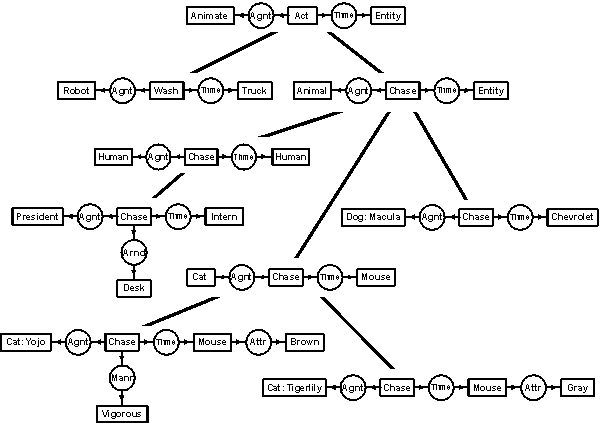
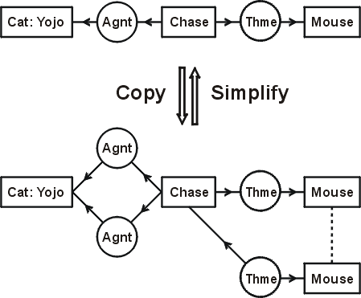

# Common Logic Controlled English (CLCE) – Sowa 2004 Draft Exploration

Transcription, examples, and notes on John F. Sowa's 2004 draft of **Common Logic Controlled English** — a controlled natural language that reads like English but translates cleanly to first-order logic (FOL), conceptual graphs (CGIF), etc.

**Live repo**: https://github.com/NullLabTests/clce-sowa-2004-exploration

## Why revive CLCE in 2026 AI research? (Usefulness Score: 7.5/10)
CLCE is a human-readable syntax for precise logic — perfect for bridging symbolic KR and modern LLMs (e.g., structured outputs, verifiable reasoning, neurosymbolic AI). As of January 2026, with Premium tools like Grok advancing hybrid systems, this could inspire AI researchers (@TheGoldenAnvil style) working on ontology engineering or explainable AI.

- **Strengths (8-9/10)**: Foundations for semantic parsing, prompt-to-FOL tools, chain-of-thought validation in LLMs. Influences CNLs used in BioASQ or RAG systems.
- **Weaknesses (6/10)**: No native support for modalities, plurals, or tenses — but extensible for neurosymbolic setups.
- **Opportunities (8/10)**: Map CLCE to vector embeddings (e.g., via LangChain) for retrieval-augmented generation, or use in XAI for human-readable logic outputs from models like Grok-4.

Original draft: http://www.jfsowa.com/clce/specs.htm

### Key Example: "Mary gives a dog a very juicy steak"
Conceptual graph form (from Sowa's CLCE draft):

### Another: "If a cat is on a mat, then it is a happy pet"
Nested context example:

### Type Hierarchy (for ontologies)
Useful for AI KR:

### Simple Copy Graph
Basic relation illustration:

## Contents
- `docs/CLCE-draft-2004.md`: Full transcribed draft excerpt (expand with your full paste if needed).
- `examples/basic.clce`: Sample sentences.
- `assets/`: Conceptual graph images for visuals.
- `LICENSE`: CC-BY-SA 4.0.

## Next Steps / Contribute
- Add Python/Prolog parser for CLCE → FOL/CGIF.
- More examples (e.g., chemical/biological ontologies via tools like BioPython).
- Integrate with 2026 AI stacks (e.g., SymPy for math proofs, NetworkX for graphs).
- Fork/PR: Let's build on this for real AI research!

